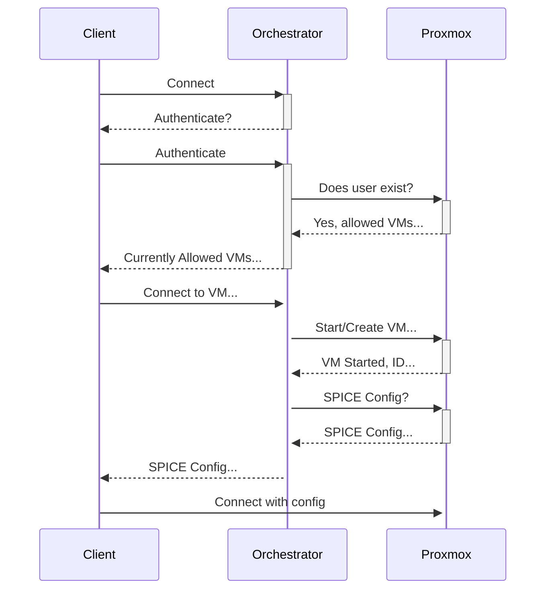

# Components

- Proxmox Host(s)
  - Runs the VDI sessions for users via SPICE
- Orchestrator
  - Orchestrates the connection between the client and the Proxmox host(s)
  - Facilitates ad-hoc VM creation based on computer or user
  - Once VM is spun up, it provides the prerequisite SPICE configuration for the client to connect
  - Administrator(s) are able to control VMs available for the users
- Client
  - Connects to the VM through the orchestrator
  - Unauthenticated logins get generic, ephemeral options based off of the computer connecting from
  - Authenticated logins are able to get user-specific profiles

# Flow

